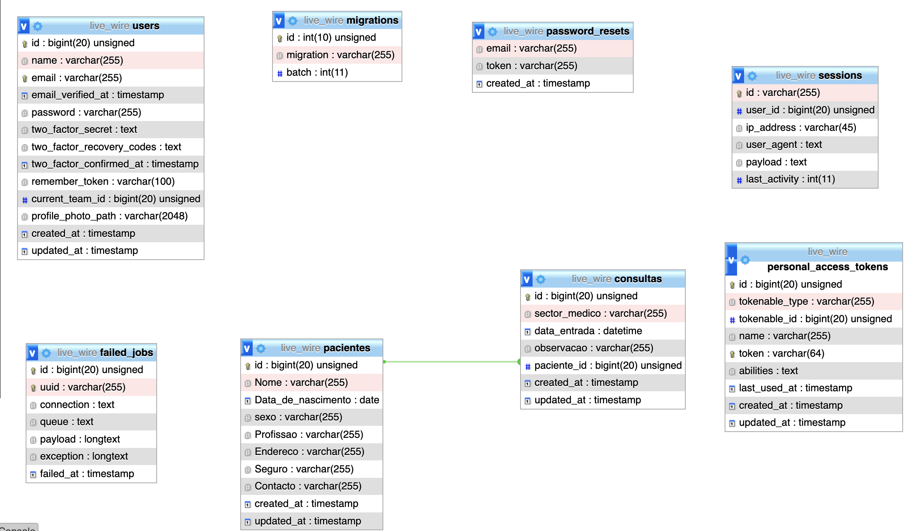

# INSTALACAO

<h2 style="color:cyan">Passo a passo</h2>
<ul>
    <li> > composer install</li>
    <li> > cp .env.example .env</li>
    <li> > Configurar o .env file</li>
    <li> > php artisan jetstream:install livewire </li> 
    <li> > npm install && npm run dev</li>
    <li> > php artisan key:generate</li>
    <li> > php artisan migrate</li>
    <li> > php artisan serve</li>
    <li> <a href="http://127.0.0.1:8000/">http://127.0.0.1:8000/</a> </li>
</ul>

# ESPECIFICACOES

<h3>Base de Dados (Tabelas)</h3>




# Instalacao usando DOCKER


Atualize as variáveis de ambiente do arquivo .env
```dosini
APP_NAME=Livewire_CHALLENGE
APP_URL=http://localhost:8180

DB_CONNECTION=mysql
DB_HOST=mysql
DB_PORT=3306
DB_DATABASE=nome_que_desejar_db
DB_USERNAME=root
DB_PASSWORD=root

CACHE_DRIVER=redis
QUEUE_CONNECTION=redis
SESSION_DRIVER=redis

REDIS_HOST=redis
REDIS_PASSWORD=null
REDIS_PORT=6379
```

Suba os containers do projeto
```sh
docker-compose up -d
```

Acessar o container
```sh
docker-compose exec app bash
```

Instalar as dependências do projeto
```sh
composer install
```

Gerar a key do projeto Laravel
```sh
php artisan key:generate
```

Acesse o projeto
[http://localhost:8180](http://localhost:8180)
